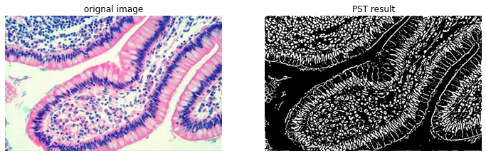
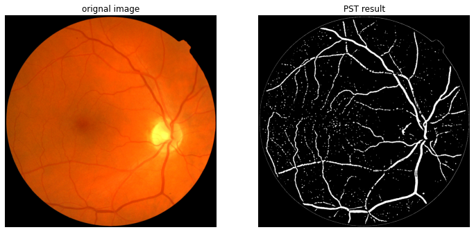
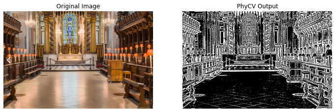
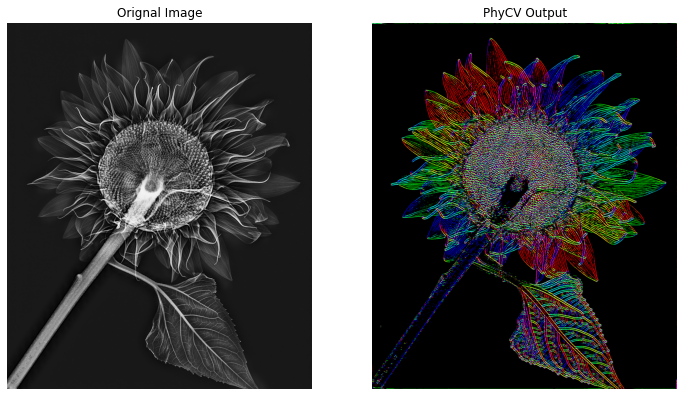
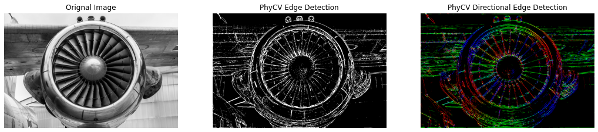
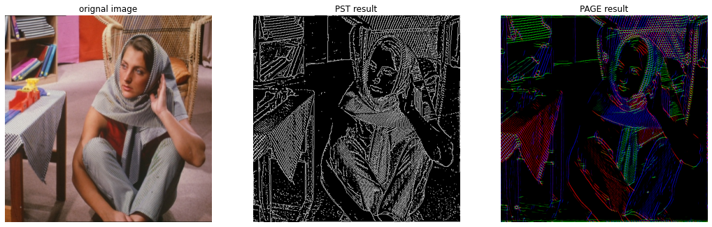

# PhyCV - The First Physics-inspired Computer Vision Library

Welcome to [PhyCV](https://en.wikipedia.org/wiki/PhyCV) ! The First Physics-inspired Computer Vision Python library developed by Jalali-Lab @ UCLA.


### *Release Notes*

- **Version 1.1.1**

  Fix minor bugs in `page_create_edge`.

- **Version 1.1.0**

  The `load_img` method now supports loading images from both an image files and image arrays.

- **Version 1.0.0**
  
  The first release of PhyCV is available!


## Contents
- [Introduction](#introduction)

- [Folder Structure](#folder-structure)

- [Installation](#installation)

- [Phase-Stretch Transform (PST)](#phase-stretch-transform-pst)
    - [CPU Version](#pst-cpu-version)

    - [GPU Version](#pst-gpu-version)
  
- [Phase-Stretch Adaptive Gradient-field Extractor (PAGE)](#phase-stretch-adaptive-gradient-field-extractor-page)

    - [CPU Version](#page-cpu-version)

    - [GPU Version](#page-gpu-version)
    

- [Sample Results](#sample-results)

- [Reference](#reference)


## Introduction
PhyCV is a Physics-inspired Computer Vision Python library. PhyCV has a new class of computer vision algorithms that emulates the propagation of light through a physical medium with natural and engineered diffractive properties followed by coherent detection. Unlike traditional algorithms that are a sequence of hand-crafted empirical rules, physics-inspired algorithms leverage physical laws of nature as blueprints. These algorithms can, in principle, be implemented in real physical devices for fast and efficient computation.  Currently, PhyCV includes Phase-Stretch Transform (PST) and Phase-Stretch Adaptive Gradient-field Extractor (PAGE). Each algorthm has CPU and GPU versions.

## Folder Structure
    .
    ├── input_images
    ├      ├── cell.png
    ├      ├── barbara.jpeg
    ├      ├── jet_engine.jpeg
    ├      └── ...
    ├     
    ├── phycv
    ├      ├── __init__.py
    ├      ├── pst.py
    ├      ├── pst_gpu.py
    ├      ├── page.py
    ├      ├── page_gpu.py
    ├      └── utils.py        
    ├
    ├── test_script1.py                
    ├── test_script2.py
    ├── requirements.txt                   
    ├── LICENSE
    ├── README.md
    └── setup.py 

## Installation
The GPU versions depend on `PyTorch`, make sure that you have `CUDA` setup before the installation. 

**From pip**
```python
pip install phycv
```

**From source**
- Download the GitHub repo
- cd to the repo directory
- Run the following command

```python
pip install .
```

## Phase-Stretch Transform (PST)
[Phase Stretch Transform (PST)](https://en.wikipedia.org/wiki/Phase_stretch_transform) is a computationally efficient edge and texture detection algorithm with exceptional performance in visually impaired images. Inspired by the physics of the photonic time stretch [1], [2] (an ultrafast and single-shot data acquisition technique), the algorithm transforms the image by emulating propagation of light through a device with engineered dispersive/diffractive property followed by coherent detection. For derivations and details, please refer to Reference [3], [4], [5], [6], [7], [8], and the [wiki](https://en.wikipedia.org/wiki/Phase_stretch_transform).


### PST CPU Version

- [Code Architect](#code-architect)
- [Example Usage](#example-usage)
- [Dependencies](#dependencies)

#### **Code Architect**

```python
class PST:
    def __init__(self, h=None, w=None):

    def load_img(self, img_file=None, img_array=None):

    def init_kernel(self, phase_strength, warp_strength):
    
    def apply_kernel(self, sigma_LPF, thresh_min, thresh_max, morph_flag):
    
    def run(self, img_file, phase_strength, warp_strength, \
            sigma_LPF, thresh_min, thresh_max, morph_flag):

```
- The `__init__` method has two parameters `h` (height) and `w` (width), which indicates the size of image the algorithm will operate on. They are set to `None` by default. If you leave them as `None` by default, their value will be determined when calling the following `load_img` method. 

- The `load_img` method can load the image from either an image file indicated by `img_file` or an image array indicated by `img_array`. Then it converts the image to greyscale if it is in RGB format, if `h` and `w` are not indicated in the `__init__` method, they will be determined by the shape of the image. Otherwise, the image will be reshaped to the indicated size.

- The `init_kernel` method initializes the PST kernel according to the parameters `phase_strength` and `warp_strength`. As for the derivation of the kernel and the physical meaning of parameters, please refer to reference [3], [4].

- The `apply_kernel` method first denoises the loaded image with a low-pass filter characterized by `sigma_LPF`, then it applies the initialized kernel to the denoised image, finally it applies morphological operation if `morph_flag==1`. The thresholds in the morphological operation are indicated by `thresh_min` and `thresh_max`.

- The `run` method wraps `load_img`, `init_kernel`, `apply_kernel` together.

#### **Example Usage**

*Example 1*

In Example 1, all steps are performed in a single `run`. The result is returned as `pst_output`. This is for users who want to get the result on a single image with indicated PST parameters. The example code can also be found in `test_script1.py`

```python
from phycv import PST
pst = PST()
pst_output = pst.run(img_file='./input_images/jet_engine.jpeg', phase_strength=0.3, warp_strength=15, sigma_LPF=0.15, thresh_min=-0.5, thresh_max=0.003, morph_flag=1)
```

*Example 2*

In Example 2, each step is performed seperately. Finally the output is saved as an attribute and can be accessed by `pst.pst_output`. This is for video processing where different frames need to be loaded but the same kernel applies to all the frames, you can call `init_kernel` only once to save computation time for fixed parameters. The example code can also be found in `test_script2.py`. Note that for real-time video processing, the frames are usually pre-loaded or captured as image arrays before running PhyCV algorithms. Under these circumstances, you can indicate the `img_array` instead of `img_file` when calling the `load_img` method. 

```python
from phycv import PST
pst = PST()
pst.load_img(img_file='./input_images/jet_engine.jpeg')
pst.init_kernel(phase_strength=0.3, warp_strength=15)
pst.apply_kernel(sigma_LPF=0.15, thresh_min=-0.5, thresh_max=0.003, morph_flag=1)
```

#### **Dependencies**

- Image IO and morphological operation depend on `mahotas`
- matrix operation and FFT depend on `numpy`
- visualization in the test script depends on `matplotlib`


### PST GPU Version

- [Code Architect](#code-architect-1)
- [Example Usage](#example-usage-1)
- [Dependencies](#dependencies-1)


#### **Code Architect**

```python
class PST_GPU:
    def __init__(self, device, h=None, w=None):

    def load_img(self, img_file=None, img_array=None):
    
    def init_kernel(self, phase_strength, warp_strength):

    def apply_kernel(self, sigma_LPF, thresh_min, thresh_max, morph_flag):
       
    def run(self, img_file, phase_strength, warp_strength, \
            sigma_LPF, thresh_min, thresh_max, morph_flag):

```
The GPU version of PST significantly accelerates the PST algorithm by operating on the GPU. The architect of the `PST_GPU` class is similar to the original `PST` class with same attributes and methods. The main differences are:

1. You have to indicate the `device` to operate on when instantiating the class.
2. The image is loaded as `torch tensor` instead of `numpy array`.
3. The returned result also locates on GPU and is in the form of `torch tensor`.

#### **Example Usage**

*Example 1*

In Example 1, all steps are performed in a single `run`. In the GPU version, you will need to indicate the `device` when instantiate the class. The result is returned as `pst_output`. Note that the returned result locates on GPU and is in the form of `torch tensor`. You may need to move to CPU and convert to `numpy array` for visualization. This is for users who want to get the result on a single image with indicated PST parameters. The example code can also be found in `test_script1.py`

```python
import torch
from phycv import PST_GPU
device = torch.device('cuda' if torch.cuda.is_available() else 'cpu')
pst = PST_GPU(device=device)
pst_output = pst.run(img_file='./input_images/jet_engine.jpeg', phase_strength=0.3, warp_strength=15, sigma_LPF=0.15, thresh_min=-0.5, thresh_max=0.003, morph_flag=1)
```

*Example 2*

In Example 2, each step is performed seperately, after  The output is saved as an attribute and can be accessed by `pst.pst_output`. This is for video processing where different frames need to be loaded but the same kernel applies to all the frames, you can call `init_kernel` only once to save computation time for fixed parameters. The example code can also be found in `test_script2.py`.

```python
import torch
from phycv import PST_GPU
device = torch.device('cuda' if torch.cuda.is_available() else 'cpu')
pst = PST_GPU(device=device)
pst.load_img(img_file='./input_images/jet_engine.jpeg')
pst.init_kernel(phase_strength=0.3, warp_strength=15)
pst.apply_kernel(sigma_LPF=0.15, thresh_min=-0.5, thresh_max=0.003, morph_flag=1)
```

#### **Dependencies**:

- Image IO is done by `torchvision`
- Matrix operation and FFT are done `torch`
- Morphological operation is done by `kornia`
- visualization in the test script depends on `matplotlib`


## Phase-Stretch Adaptive Gradient-field Extractor (PAGE)

[Phase-Stretch Adaptive Gradient-field Extractor (PAGE)](https://en.wikipedia.org/wiki/Phase-stretch_Adaptive_Gradient-field_Extractor) is a physics-inspired algorithm for detecting edges and their orientations in digital images at various scales. The algorithm is based on the diffraction equations of optics. Metaphorically speaking, PAGE emulates the physics of birefringent (orientation-dependent) diffractive propagation through a physical device with a specific diffractive structure. The propagation converts a real-valued image into a complex function. Related information is contained in the real and imaginary components of the output. The output represents the phase of the complex function. For derivations and more details please refer to Reference [9],[10] and the [wiki](https://en.wikipedia.org/wiki/Phase-stretch_Adaptive_Gradient-field_Extractor).

### PAGE CPU Version

- [Code Architect](#code-architect-2)
- [Example Usage](#example-usage-2)
- [Dependencies](#dependencies-2)

#### **Code Architect**

```python
class PAGE:
    def __init__(self,direction_bins, h=None, w=None):

    def load_img(self, img_file=None, img_array=None):

    def init_kernel(self, mu_1, mu_2, sigma_1, sigma_2, S1, S2):
    
    def apply_kernel(self, sigma_LPF, thresh_min, thresh_max, morph_flag):    

    def create_page_edge(self):

    def run(self, img_file, mu_1, mu_2, sigma_1, sigma_2, S1, S2,\
            sigma_LPF, thresh_min, thresh_max, morph_flag):
```

- To instantiate a `PAGE` class, three parameters `h` (height), `w` (width), and `direction_bins` are needed. `h` and `w` are set to `None` by default. If you leave them as `None` by default, their value will be determined when calling the following `load_img` method. 

- The `load_img` method can load the image from either an image file indicated by `img_file` or an image array indicated by `img_array`. Then it converts the image to greyscale if it is in RGB format, if `h` and `w` are not indicated in the `__init__` method, they will be determined by the shape of the image. Otherwise, the image will be reshaped to the indicated size.

- The `init_kernel` method initializes the PAGE kernel according to the parameters `mu_1`, `mu_2`, `sigma_1`, `sigma_2`, `S1`, `S2`. In the CPU version, kernels for different frequency bins are initialized in serial. As for the derivation of the kernel and the physical meaning of parameters, please refer to references [9], [10].

- The `apply_kernel` method first denoises the loaded image with a low-pass filter characterized by `sigma_LPF`, then it applies the initialized kernel to the denoised image, finally it applies morphological operation if `morph_flag==1`. The thresholds in the morphological operation are indicated by `thresh_min` and `thresh_max`.

- The `create_page_edge` method creates a weighted color image of PAGE output to visualize directionality of edges.

- The `run` method wraps `load_img`, `init_kernel`, `apply_kernel`, `create_page_edge` together.

#### **Example Usage**

*Example 1*

In Example 1, all steps are performed in a single `run`. The result is returned as `page_edge`. This is for users who want to get the result on a single image with indicated PAGE parameters. The example code can also be found in `test_script1.py`.

```python
from phycv import PAGE
page = PAGE(direction_bins=10)
page_edge = page.run(img_file='./input_images/jet_engine.jpeg', mu_1=0, mu_2=0.35, sigma_1=0.05, sigma_2=0.7, S1=0.8, S2=0.8, sigma_LPF=0.08, thresh_min=-1, thresh_max=0.0004, morph_flag=1)

```

*Example 2*

In Example 2, each step is performed seperately. Finally the output is saved as an attribute and can be accessed by `page.page_edge`. This is for video processing where different frames need to be loaded but the same kernel applies to all the frames, you can call `init_kernel` only once to save computation time for fixed parameters. The example code can also be found in `test_script2.py`.


```python
from phycv import PAGE
page = PAGE(direction_bins=10)
page.load_img(img_file='./input_images/jet_engine.jpeg')
page.init_kernel(mu_1=0, mu_2=0.35, sigma_1=0.05, sigma_2=0.7, S1=0.8, S2=0.8)
page.apply_kernel(sigma_LPF=0.08, thresh_min=-1, thresh_max=0.0004, morph_flag=1)
page.create_page_edge()
```

#### **Dependencies**:

- Image IO and morphological operation are done by `mahotas`
- matrix operation and FFT are done by `numpy`
- visualization in the test script depends on `matplotlib`


### PAGE GPU Version

- [Code Architect](#code-architect-3)
- [Example Usage](#example-usage-3)
- [Dependencies](#dependencies-3)

#### **Code Architect**

```python
class PAGE_GPU:
    def __init__(self, direction_bins, device, h=None, w=None):

    def load_img(self, img_file=None, img_array=None):

    def init_kernel(self, mu_1, mu_2, sigma_1, sigma_2, S1, S2):
    
    def apply_kernel(self, sigma_LPF, thresh_min, thresh_max, morph_flag):    

    def create_page_edge(self):

    def run(self, img_file, mu_1, mu_2, sigma_1, sigma_2, S1, S2,\
            sigma_LPF, thresh_min, thresh_max, morph_flag):
```

The GPU version of PAGE significantly accelerates the PAGE algorithm by operating on the GPU. The `init_kernel` and `apply_kernel` are done in parallel. The architect of the `PAGE_GPU` class is similar to the original `PAGE` class with same attributes and methods. The main differences are listed below:

1. You have to indicate the `device` to operate on when instantiating the class.
2. The image is loaded as `torch tensor` instead of `numpy array`.
3. The returned result also locates on GPU and is in the form of `torch tensor`.
4. In the `init_kernel` method, the kernel for different frequency bins are initialized in parallel by using broadcasting. 
5. In the `apply_kernel` method, the kernel for different frequency bins are applied to the image also in parallel by using broadcasting. 

#### **Example Usage**

*Example 1*

In Example 1, all steps are performed in a single `run`. In the GPU version, you will need to indicate the device. Note that the returned result locates on GPU and is in the form of `torch tensor`. You may need to move to CPU and convert to `numpy array` for visualization. The result is returned as `page_edge`. This is for users who want to get the result on a single image with indicated PAGE parameters.  The example code can also be found in `test_script1.py`.

```python
import torch
from phycv import PAGE_GPU
device = torch.device('cuda' if torch.cuda.is_available() else 'cpu')
page = PAGE_GPU(direction_bins=10, device=device)
page_edge = page.run(img_file='./input_images/jet_engine.jpeg', mu_1=0, mu_2=0.35, sigma_1=0.05, sigma_2=0.7, S1=0.8, S2=0.8, sigma_LPF=0.08, thresh_min=-1, thresh_max=0.0004, morph_flag=1)

```

*Example 2*

In Example 2, each step is performed seperately, after  The output is saved as an attribute and can be accessed by `page.page_edge`. This is for video processing where different frames need to be loaded but the same kernel applies to all the frames, you can call `init_kernel` only once to save computation time for fixed parameters. The example code can also be found in `test_script2.py`.

```python
import torch
from phycv import PAGE_GPU
device = torch.device('cuda' if torch.cuda.is_available() else 'cpu')
page = PAGE_GPU(direction_bins=10, device=device)
page.load_img(img_file='./input_images/jet_engine.jpeg')
page.init_kernel(mu_1=0, mu_2=0.35, sigma_1=0.05, sigma_2=0.7, S1=0.8, S2=0.8)
page.apply_kernel(sigma_LPF=0.08, thresh_min=-1, thresh_max=0.0004, morph_flag=1)
page.create_page_edge()

```

#### **Dependencies**:

- Image IO is done by `torchvision`
- Matrix operation and FFT are done `torch`
- Morphological operation is done by `kornia`
- visualization in the test script depends on `matplotlib`


## Sample Results
In this section, we provide sample results by running the algorithms in PhyCV on images in the `input_image` folder. The parameters to reproduce the results are also attached. 

**Note**: the results from CPU and GPU version may look slightly different, because the morphological operation at the end is implemented using different image processing packages (`mahotas` for CPU version and `kornia` for GPU version). The CPU version will lead to thinner output. You can always set the `morph_flag=0` and add customized morphological operation later on. 

### 1. Feature detection in the cell image

```python
img_file = 'input_images/cell.png'
# PST_GPU Parameters
phase_strength = 0.5, warp_strength = 20
sigma_LPF = 0.1, thresh_min = -1, thresh_max = 0.001, morph_flag = 1

```
<p align="center">
  
</p>

### 2. Retina vessel detection

```python
img_file = 'input_images/retina.jpg'
# PST_GPU Parameters
phase_strength = 10, warp_strength = 90
sigma_LPF = 0.05, thresh_min = -1, sthresh_max = 0.008, morph_flag = 1
```

<p align="center">
  
</p>

### 3. Edge detection of a palace image

```python
img_file = 'input_images/palace.png'
# PST_GPU Parameters
phase_strength = 0.8, warp_strength = 20
sigma_LPF = 0.1, thresh_min = -1, thresh_max = 0.002, morph_flag = 1
```
<p align="center">
  
</p>

### 4. Edge detection with orientation for wind rose 
```python
img_file = 'input_images/wind_rose.png'
# PAGE_GPU parameters
direction_bins=10, mu_1 = 0, mu_2 = 0.35, sigma_1 = 0.05, sigma_2 = 0.8, S1 = 0.8, S2 = 0.8
sigma_LPF = 0.1, thresh_min=-1, thresh_max=0.0005, morph_flag = 1
```
<p align="center">
  
</p>


### 5. Edge detection with orientation for sunflower
```python
img_file = 'input_images/sunflower.jpg'
# PAGE_GPU parameters
direction_bins=10, mu_1 = 0, mu_2 = 0.35, sigma_1 = 0.05, sigma_2 = 0.8, S1 = 0.8, S2 = 0.8
sigma_LPF = 0.05, thresh_min = -1, thresh_max = 0.0003, morph_flag = 1
```
<p align="center">
  
</p>


### 6. Comparison of PST and PAGE (I)
```python
img_file = 'input_images/jet_engine.jpeg'
# PST_GPU Parameters
phase_strength = 0.3, warp_strength = 15
sigma_LPF = 0.15, thresh_min = -0.5, thresh_max = 0.003, morph_flag = 1
# PAGE_GPU Parameters
direction_bins=10, mu_1=0, mu_2 = 0.35, sigma_1 = 0.05, sigma_2 = 0.7, S1 = 0.8 ,S2 = 0.8
sigma_LPF = 0.08, thresh_min = -1, thresh_max = 0.0004, morph_flag = 1
```
<p align="center">
  
</p>

### 7. Comparison of PST and PAGE (II)
```python
img_file = 'input_images/barbara.jpeg'
# PST Parameters
phase_strength = 0.8, warp_strength = 15
sigma_LPF = 0.15, thresh_min = -0.5, thresh_max = 0.003, morph_flag = 1
# PAGE Parameters
direction_bins = 30, mu_1 = 0, mu_2 = 0.2, sigma_1 = 0.05, sigma_2 = 0.6, S1 = 0.5, S2 = 0.5
sigma_LPF = 0.1, thresh_min=-0.5, thresh_max=0.0001, morph_flag = 1
```
<p align="center">
  
</p>


## Reference
[1] Time-stretched analogue-to-digital conversion. Bhushan et al. Eletronic Letters techniques, 1998

[2] Time stretch and its applications. Mahjoubfar et al. Nature Photonics, 2017

[3] Physics-inspired image edge detection. Asghari et al. IEEE Global Signal and Information Processing Symposium, 2014

[4] Edge detection in digital images using dispersive phase stretch. Asghari et al.  International Journal of Biomedical Imaging, 2015

[5] Feature Enhancement in Visually Impaired Images. Suthar et al. IEEE Access, 2018

[6] Image segmentation of activated sludge phase contrast images using phase stretch transform. Ang et al. Microscopy, 2019

[7] Dolphin Identification Method Based on Improved PST. Wang et al. In 2021 IEEE/ACIS 6th International Conference on Big Data, Cloud Computing, and Data Science (BCD), 2021.

[8] A local flow phase stretch transform for robust retinal vessel detection. Challoob et al. In International Conference on Advanced Concepts for Intelligent Vision Systems, 2020.

[9] Phase-stretch adaptive gradient-field extractor (page). Suthar et al. Coding Theory, 2020

[10] Phase-Stretch Adaptive Gradient-Field Extractor (PAGE). MacPhee et al. arXiv preprint arXiv:2202.03570, 2022
