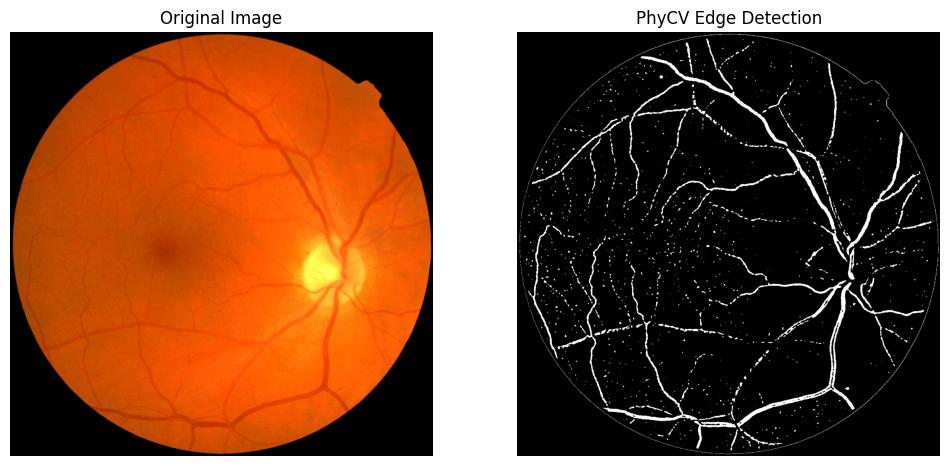
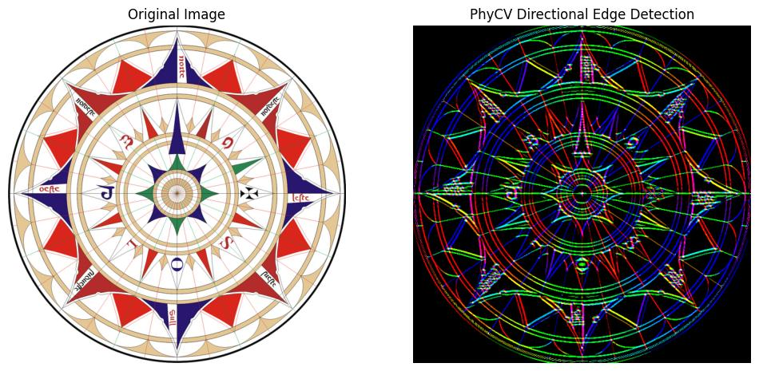
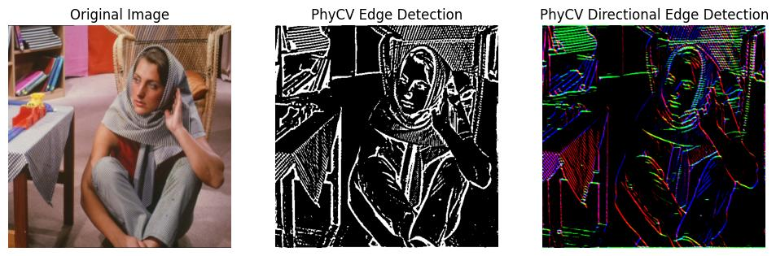

<p align="center">
  
</p>

# PhyCV: The First Physics-inspired Computer Vision Library

<a href="https://colab.research.google.com/drive/1_4OASJRSkwc6u1kq8mqMNfqpo3h_0pGU?usp=sharing"></a> 
[](https://pypi.org/project/phycv/)
[](https://arxiv.org/abs/2301.12531)

[](https://www.youtube.com/playlist?list=PLj--iTBXPaTWABQstUFA6l6_Rf3uiZq9T)
[](https://en.wikipedia.org/wiki/PhyCV)

Welcome to PhyCV ! The First Physics-inspired Computer Vision Python library developed by [Jalali-Lab](https://photonics.ucla.edu/) @ UCLA. This repo is maintained by [Yiming Zhou](https://yiming0416.github.io/). See the release notes [here](./assets/docs/change_log.md).

We released the C++ version of PhyCV with CUDA acceleration. Check out the PhyCV-CUDA repo [here](https://github.com/JalaliLabUCLA/phycv-cuda)!

## Contents

* [Introduction](#introduction)

* [Folder Structure](#folder-structure)

* [Installation](#installation)

* [Phase-Stretch Transform (PST)](#phase-stretch-transform-pst)

* [Phase-Stretch Adaptive Gradient-field Extractor (PAGE)](#phase-stretch-adaptive-gradient-field-extractor-page)

* [Vision Enhancement via Virtual diffraction and coherent Detection (VEViD)](#vision-enhancement-via-virtual-diffraction-and-coherent-detection-vevid)

* [Sample Results](#sample-results)

* [Reference](#reference)

* [Citation](#citation)

## Introduction

PhyCV is a Physics-inspired Computer Vision Python library. PhyCV has a new class of computer vision algorithms that emulates the propagation of light through a physical medium with natural and engineered diffractive properties followed by coherent detection. Unlike traditional algorithms that are a sequence of hand-crafted empirical rules, physics-inspired algorithms leverage physical laws of nature as blueprints. These algorithms can, in principle, be implemented in real physical devices for fast and efficient computation. Currently, PhyCV includes Phase-Stretch Transform (PST), Phase-Stretch Adaptive Gradient-field Extractor (PAGE) and Vision Enhancement via Virtual diffraction and coherent Detection (VEViD). Each algorthm has CPU and GPU versions.

## Folder Structure

- `assets`: sample input images/videos, sample results, documentations.
- `phycv`: source code of PhyCV.
- `scripts`: examples of running PhyCV with python scripts. 

## Installation

The GPU versions depend on `PyTorch` and `torchvision`. Please follow the instructions on [PyTorch Official Website](https://pytorch.org/) to install the correct version of `CUDA ToolKit` and `PyTorch` according to your system setup.

**From pip**

```bash
pip install phycv
```

**From source**

```bash
git clone https://github.com/JalaliLabUCLA/phycv.git
cd phycv
pip install .
```

## Phase-Stretch Transform (PST)

Phase Stretch Transform (PST) is a computationally efficient edge and texture detection algorithm with exceptional performance in visually impaired images. Inspired by the physics of the photonic time stretch [1], [2] (an ultrafast and single-shot data acquisition technique), the algorithm transforms the image by emulating propagation of light through a device with engineered dispersive/diffractive property followed by coherent detection [3], [4], [5], [[wiki]](https://en.wikipedia.org/wiki/Phase_stretch_transform). It has been successfully used in many applications [6], [7], [8]. See more docs [here](./assets/docs/pst.md).

## Phase-Stretch Adaptive Gradient-field Extractor (PAGE)

Phase-Stretch Adaptive Gradient-field Extractor (PAGE) is a physics-inspired algorithm for detecting edges and their orientations in digital images at various scales [9], [10]. The algorithm is based on the diffraction equations of optics. Metaphorically speaking, PAGE emulates the physics of birefringent (orientation-dependent) diffractive propagation through a physical device with a specific diffractive structure. By using a bank of filters, PAGE detects edges in different directions. The directional edge detection gives PAGE the ability to pick out structural details from images in a way that PST cannot. See more docs [here](./assets/docs/page.md).

## Vision Enhancement via Virtual diffraction and coherent Detection (VEViD)

Similar to PST and PAGE, VEViD a efficient and interpretable low-light and color enhancement algorithm that reimagines a digital image as a spatially varying metaphoric light field and then subjects the field to the physical processes akin to diffraction and coherent detection. The term “Virtual” captures the deviation from the physical world. The light field is pixelated and the propagation imparts a phase with an arbitrary dependence on frequency which can be different from the quadratic behavior of physical diffraction. Please refer to [11] for more details. See more docs [here](./assets/docs/vevid.md).


## Sample Results

In this section, we provide sample results by running the algorithms in PhyCV on images in the `input_image` folder. The parameters to reproduce the results are also attached. 

### 1. Feature detection in the cell image

```python
img_file = './assets/input_images/cell.png'
# PST Parameters
phase_strength = 0.4, warp_strength = 20
sigma_LPF = 0.1, thresh_min = 0.0, thresh_max = 0.8, morph_flag = 1

```

<p align="center">
  
</p>

### 2. Retina vessel detection

```python
img_file = './assets/input_images/retina.jpg'
# PST Parameters
phase_strength = 0.5, warp_strength = 30
sigma_LPF = 0.05, thresh_min = 0.05, sthresh_max = 0.78, morph_flag = 1
```

<p align="center">
  
</p>

### 3. Edge detection of a palace image

```python
img_file = './assets/input_images/palace.png'
# PST Parameters
phase_strength = 0.4, warp_strength = 20
sigma_LPF = 0.1, thresh_min = 0.0, thresh_max = 0.75, morph_flag = 1
```

<p align="center">
  
</p>

### 4. Directional edge detection of a wind rose 

```python
img_file = './asset/input_images/wind_rose.png'
# PAGE parameters
direction_bins=10, mu_1 = 0, mu_2 = 0.35, sigma_1 = 0.05, sigma_2 = 0.8, S1 = 0.8, S2 = 0.8
sigma_LPF = 0.1, thresh_min=0.0, thresh_max=0.9, morph_flag = 1
```

<p align="center">
  
</p>

### 5. Directional edge detection of a sunflower

```python
img_file = './assets/input_images/sunflower.jpg'
# PAGE parameters
direction_bins=10, mu_1 = 0, mu_2 = 0.35, sigma_1 = 0.05, sigma_2 = 0.8, S1 = 0.8, S2 = 0.8
sigma_LPF = 0.1, thresh_min = 0.0, thresh_max = 0.9, morph_flag = 1
```

<p align="center">
  
</p>

### 6. Comparison of edge detection with and without orientation (I)

```python
img_file = './asset/input_images/jet_engine.jpeg'
# PST Parameters
phase_strength = 0.3, warp_strength = 15
sigma_LPF = 0.15, thresh_min = 0.0, thresh_max = 0.85, morph_flag = 1
# PAGE Parameters
direction_bins=10, mu_1=0, mu_2 = 0.35, sigma_1 = 0.05, sigma_2 = 0.8, S1 = 0.8 ,S2 = 0.8
sigma_LPF = 0.15, thresh_min = 0.0, thresh_max = 0.85, morph_flag = 1
```

<p align="center">
  
</p>

### 7. Comparison of edge detection with and without orientation (II)

```python
img_file = './assets/input_images/barbara.jpeg'
# PST Parameters
phase_strength = 0.3, warp_strength = 15
sigma_LPF = 0.1, thresh_min = 0.0, thresh_max = 0.8, morph_flag = 1
# PAGE Parameters
direction_bins = 30, mu_1 = 0, mu_2 = 0.2, sigma_1 = 0.05, sigma_2 = 0.6, S1 = 0.5, S2 = 0.5
sigma_LPF = 0.1, thresh_min=0.0, thresh_max=0.92, morph_flag = 1
```

<p align="center">
  
</p>

### 8. Low-light enhancement of a street scene

```python
img_file = './assets/input_images/street_scene.png'
# VEViD parameters
S = 0.2, T = 0.001, b = 0.16, G = 1.4
# VEViD Lite parameters
b = 0.16, G = 1.4
```

<p align="center">
  
</p>

### 9. Low-light enhancement of a dark road

```python
img_file = './assets/input_images/dark_road.jpeg'
# VEViD parameters
S = 0.2, T = 0.001, b = 0.16, G = 1.4
# VEViD Lite parameters
b = 0.16, G = 1.4
```

<p align="center">
  
</p>

### 10. Color enhancement of a flower

```python
img_file = './assets/input_images/flower.png'
# VEViD parameters
S = 0.4, T = 0.001, b = 0.2, G = 1.5
# VEViD Lite parameters
b = 0.2, G = 1.5
```

<p align="center">
  
</p>

## Reference

[1] Time-stretched analogue-to-digital conversion. Bhushan et al. Eletronic Letters techniques, 1998

[2] Time stretch and its applications. Mahjoubfar et al. Nature Photonics, 2017

[3] Physics-inspired image edge detection. Asghari et al. IEEE Global Signal and Information Processing Symposium, 2014

[4] Edge detection in digital images using dispersive phase stretch. Asghari et al.  International Journal of Biomedical Imaging, 2015

[5] Feature Enhancement in Visually Impaired Images. Suthar et al. IEEE Access, 2018

[6] Image segmentation of activated sludge phase contrast images using phase stretch transform. Ang et al. Microscopy, 2019

[7] Dolphin Identification Method Based on Improved PST. Wang et al. In 2021 IEEE/ACIS 6th International Conference on Big Data, Cloud Computing, and Data Science (BCD), 2021.

[8] A local flow phase stretch transform for robust retinal vessel detection. Challoob et al. In International Conference on Advanced Concepts for Intelligent Vision Systems, 2020.

[9] Phase-stretch adaptive gradient-field extractor (page). Suthar et al. Coding Theory, 2020

[10] Phase-Stretch Adaptive Gradient-Field Extractor (PAGE). MacPhee et al. arXiv preprint arXiv:2202.03570, 2022

[11] VEViD: Vision Enhancement via Virtual diffraction and coherent Detection. Jalali et al. eLight, 2022

## Citation

If you find PhyCV useful in your research, please star :star: this repository and consider citing the following [preprint](https://arxiv.org/abs/2301.12531):
```
@article{zhou2023phycv,
  title={PhyCV: The First Physics-inspired Computer Vision Library},
  author={Zhou, Yiming and MacPhee, Callen and Suthar, Madhuri and Jalali, Bahram},
  journal={arXiv preprint arXiv:2301.12531},
  year={2023}
}